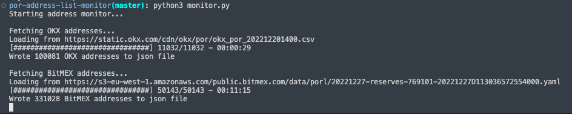
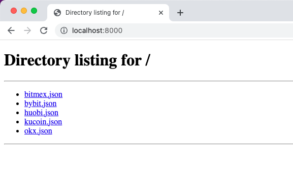

# POR address monitor

Script to monitor addresses published by exchanges as part of their proof of reserves (POR) process.

## Setup

```
pip3 install -r requirements.txt
```

## Running the monitor

This will check the latest addresses published by exchanges (OKX and BitMEX) every 30 minutes, parse the result and then write the output in a consistent JSON format to `./reserves/okx.csv` and `./reserves/bitmex.csv`.

```
python3 monitor.py
```

There are also address files for bybit, huobi and kucoin, but these are not currently actively monitored because the exchanges do not maintain a consistently updated address list (their addresses are only published in blog posts). The output should look something like this:



## Running the server

This will run a simple web server on port 8000 that serves the latest data from the monitor.

```
python3 -m http.server -d reserves 8000
```

You can visit at: [http://localhost:8000](http://localhost:8000). It should look something like this:



Example GET request to fetch the latest addresses from kucoin:

```
curl http://localhost:8000/kucoin.json
```